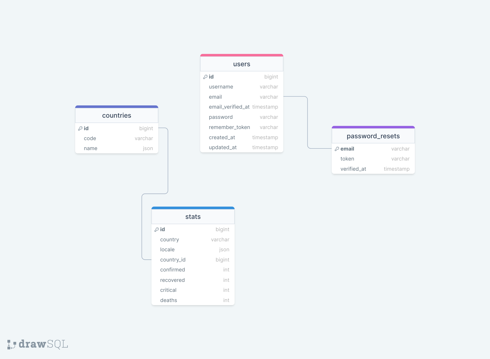

<div style="display:flex; align-items: center; justify-content:center; margin-bottom:20px;">
  
</div>
<div>
  <h1 style="position:relative; top: -6px" >Coronatime</h1>
</div>


Coronatime webpage enables registered user to view current corona pandemic statistics worldwide as well as by country.
<br>
Authorized user can login to admin dashboard and search and filter most resent corona data as one sees fit.

#
### Table of Contents
* [Prerequisites](#prerequisites)
* [Tech Stack](#tech-stack)
* [Getting Started](#getting-started)
* [Migrations](#migration)
* [Create Admin](#create-admin)
* [Development](#development)
* [Project Structure](#project-structure)
* [Database Design Diagram](#database-design-diagram)

#
### Prerequisites

*  *PHP@8.02 and up*
*  *MYSQL@8 and up*
*  *npm@6 and up*
*  *composer@2 and up*


#
### Tech Stack

*  [Laravel@9.x](https://laravel.com/docs/6.x) - back-end framework

#
### Getting Started
1\. First of all you need to clone coronatime repository from github:
```sh
git clone https://github.com/RedberryInternship/lomidze-coronatime.git
```

2\. Next step requires you to run *composer install* in order to install all the dependencies.
```sh
composer install
```

3\. after you have installed all the PHP dependencies, it's time to install all the JS dependencies:
```sh
npm install
```

and also:
```sh
npm run dev
```
in order to build your tailwind resources.

4\. Now we need to set our env file. Go to the root of your project and execute this command.
```sh
cp .env.example .env
```
And now you should provide **.env** file all the necessary environment variables:

#
**MYSQL:**
>DB_CONNECTION=mysql

>DB_HOST=127.0.0.1

>DB_PORT=3306

>DB_DATABASE=*****

>DB_USERNAME=*****

>DB_PASSWORD=*****

##### Now, you should be good to go!


#
### Generate App key
if you've completed getting started section, generate app key:
```sh
php artisan key:generate
```

#
### Migration
then migrating database is fairly simple process, just execute:
```sh
php artisan migrate
```

#
### Publish assets
To create the symbolic link to make assets accessible from the web
```sh
php artisan storage:link
```

#
### Development

You can run Laravel's built-in development server by executing:

```sh
  php artisan serve
```
and then refer to the next segment.

#
### Create Admin

With this command, you can fetch countries data from api endpoint

```sh
  php artisan fetch:countries
```

With this command, you can fetch statistics based on countries data from api endpoint

```sh
  php artisan fetch:stats
```

#
### Project Structure

```bash
├─── app
│   ├─── Console
│   │   ├─── commands
│   ├─── Exceptions
│   ├─── Http
│   │   ├─── Controllers
│   │   ├─── Middleware
│   │   ├─── Requests
│   ├─── Models
│   ├─── Providers
├─── bootstrap
├─── config
├─── database
├─── lang
├─── public
├─── readme
├─── resources
├─── routes
├─── storage
├─── tests
- .env
- artisan
- composer.json
- package.json
- phpunit.xml
```

#
### Database Design Diagram
[drawSQL link](https://drawsql.app/teams/geo-3/diagrams/coronatime)

<a href="https://drawsql.app/teams/geo-3/diagrams/movie-quotes" target="blank_">
  
<a/>